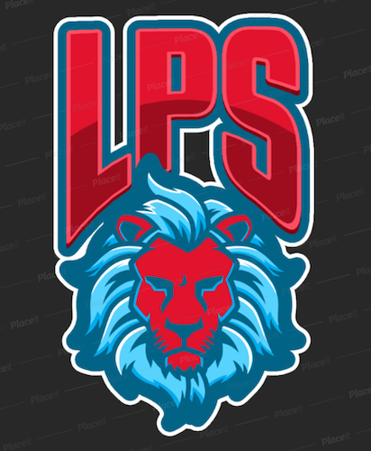

# Lines Police CAD

This is a easy to setup and use police server CAD. Includes a signup/login for both Civilians and Police Officers. Also this is mobile friendly.

### Requirements : 
1.  [Node.js](https://nodejs.org/en/)
1.  [MongoDB](https://docs.mongodb.com/manual/administration/install-community/)

### Getting Started with Code  : 
1. [Set Up MongoDB](#setting-up-mongodb) and start mongodb
2. Clone repo from https://github.com/Linesmerrill/police-cad.git
3. Run `npm install` to install dependencies.
4. Duplicate `.env.example` and rename the new file to `.env`. Edit to your configurations.
1. Run `npm start` to boot up server.
1. Go to http://localhost:8080.

### Setting up MongoDB
1. Install mongodb via brew [Step by step instructions](https://docs.mongodb.com/manual/tutorial/install-mongodb-on-os-x/)
1. Start mongodb via brew [Step by step instructions](https://docs.mongodb.com/manual/tutorial/install-mongodb-on-os-x/#run-mongodb-community-edition)

### Accessing the Database
1. Locally this will use the knoldus db (or whatever you specify manually)
1. launch mongo via your command-line: `mongo`
1. Use `show dbs` to see all that are available. You should see `knoldus` in the list.
1. Lets use that db: `use knoldus`.
