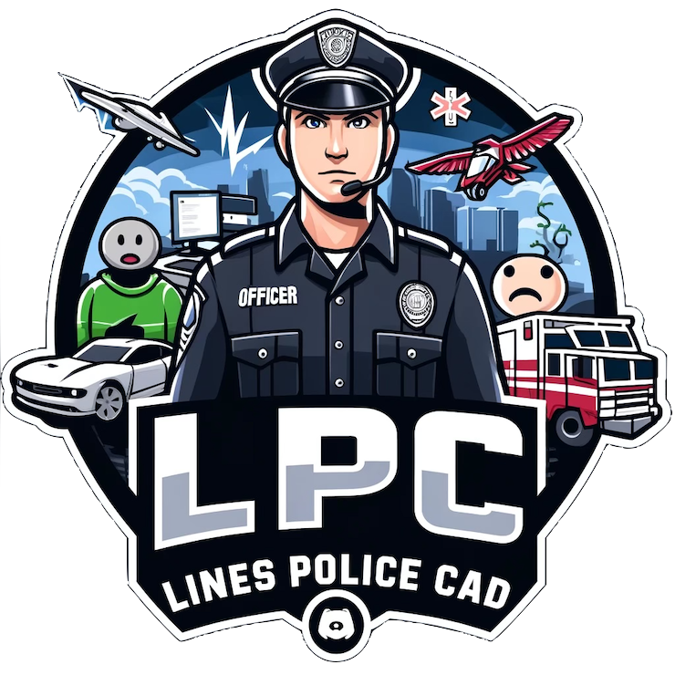

# Lines Police CAD



[](https://github.com/linesmerrill/police-cad)

**World's Leading Free-to-use service for Role-play communities**

A free to use Civilian, Police, EMS and Dispatch management CAD (Computer Aided Dispatch). Built to help facilitate role-play communities across the globe. This is Web and Mobile friendly and can support community specific operations when creating civilians, citations and more.

## Features

- 🚔 **Civilian & Officer Management** - Signup/login for both Civilians and Police Officers
- 📱 **Mobile Friendly** - Responsive design that works on all devices
- 🌐 **Web-Based** - Easy to access from any browser
- 🎮 **GTA V FiveM Integration** - Built for GTA V's Modding framework: FiveM
- 🔄 **Modern Stack** - Next.js 14, React, TypeScript, Express.js, MongoDB

## Requirements

1. [Node.js](https://nodejs.org/en/) (v20.x recommended)
2. [MongoDB](https://docs.mongodb.com/manual/administration/install-community/)

## Getting Started

### 1. Clone the Repository

```bash
git clone https://github.com/Linesmerrill/police-cad.git
cd police-cad
```

### 2. Install Dependencies

```bash
npm install
```

### 3. Configure Environment Variables

Duplicate `.env.example` and rename the new file to `.env`. Edit to your configurations.

```bash
cp .env.example .env
```

### 4. Set Up MongoDB

#### macOS (via Homebrew)

1. Install MongoDB: [Step by step instructions](https://docs.mongodb.com/manual/tutorial/install-mongodb-on-os-x/)
2. Start MongoDB: [Step by step instructions](https://docs.mongodb.com/manual/tutorial/install-mongodb-on-os-x/#run-mongodb-community-edition)

#### Other Platforms

Follow the [MongoDB installation guide](https://docs.mongodb.com/manual/administration/install-community/) for your platform.

### 5. Run the Backend API Service

We have migrated most of our backend code to our [police-cad-api](https://github.com/Linesmerrill/police-cad-api) microservice. This is now required to be running in order to access certain parts of the app.

Follow the instructions to start and run that service [here](https://github.com/Linesmerrill/police-cad-api#police-cad-api).

Once running, you will need to add two new environment variables. You can see an example of those [here](https://github.com/Linesmerrill/police-cad/blob/main/.env.example#L12).

### 6. Start the Development Server

```bash
npm run dev
```

The application will be available at `http://localhost:8080`.

### 7. Production Build

```bash
npm run build:local  # Runs linting and builds
npm start            # Starts the production server
```

## Development Scripts

- `npm run dev` - Start development server with hot reload
- `npm run next:dev` - Start Next.js development server only
- `npm run lint` - Run ESLint
- `npm run lint:fix` - Run ESLint and auto-fix issues
- `npm run build:local` - Run linting and build for production
- `npm start` - Start production server

## Project Structure

- `/app` - Next.js App Router pages and components
- `/components` - React components (Navbar, Footer, etc.)
- `/views` - Legacy EJS templates (being migrated to Next.js)
- `/public` - Static assets (images, etc.)
- `/app/routes.js` - Express.js routes
- `/server.js` - Next.js integrated Express server

## Technology Stack

- **Frontend**: Next.js 14, React, TypeScript
- **Backend**: Express.js, Node.js
- **Database**: MongoDB
- **Styling**: Tailwind CSS, Inline Styles
- **Authentication**: Passport.js

## Contributing

We welcome contributions! Please feel free to submit a Pull Request.

## License

See [LICENSE](LICENSE) file for details.

## Support

- **Website**: [https://www.linespolice-cad.com](https://www.linespolice-cad.com)
- **Discord**: Join our Discord community
- **Contact**: Visit our [Contact Us](/contact-us) page

---

**Note**: This project is actively being migrated from EJS templates to Next.js. Some pages may still use the legacy EJS format.
